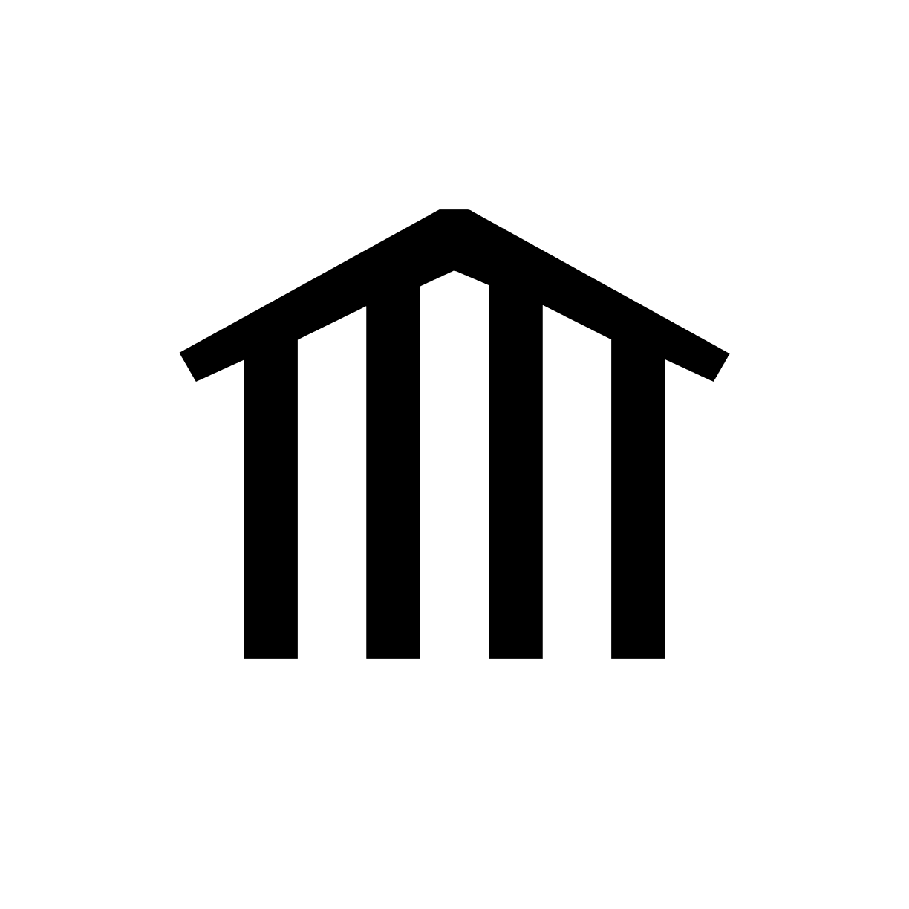
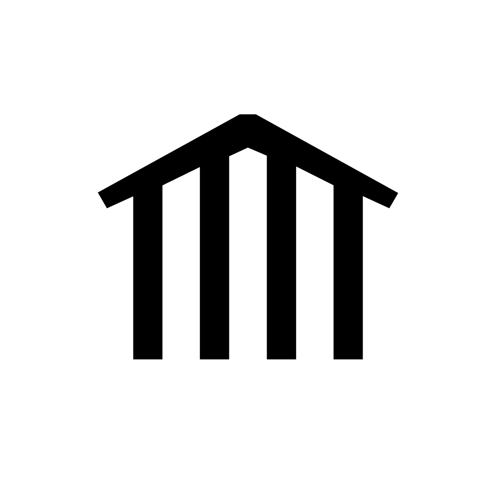

# Media Kit

Assets in PNG and SVG format for [CommunityScale](https://communityscale.com/).

## Logos & Wordmarks

### Symbols

#### White Symbol

**PNG:** `https://raw.githubusercontent.com/CommunityScale/media-kit/main/png/communityscale-symbol-white.png`
**SVG:** `https://raw.githubusercontent.com/CommunityScale/media-kit/main/svg/communityscale-symbol-white.svg`

#### Black Symbol

**PNG:** `https://raw.githubusercontent.com/CommunityScale/media-kit/main/png/communityscale-symbol-black.png`
**SVG:** `https://raw.githubusercontent.com/CommunityScale/media-kit/main/svg/communityscale-symbol-black.svg`

### Wordmarks

#### White Wordmark

**PNG:** `https://raw.githubusercontent.com/CommunityScale/media-kit/main/png/communityscale-wordmark-white.png`
**SVG:** `https://raw.githubusercontent.com/CommunityScale/media-kit/main/svg/communityscale-wordmark-white.svg`

#### Black Wordmark

**PNG:** `https://raw.githubusercontent.com/CommunityScale/media-kit/main/png/communityscale-wordmark-black.png`
**SVG:** `https://raw.githubusercontent.com/CommunityScale/media-kit/main/svg/communityscale-wordmark-black.svg`

### Logo Variations

#### Rounded Logo - White on Black

**PNG:** `https://raw.githubusercontent.com/CommunityScale/media-kit/main/png/communityscale-logo-rounded-white-on-black.png`
**SVG:** `https://raw.githubusercontent.com/CommunityScale/media-kit/main/svg/communityscale-logo-rounded-white-on-black.svg`

#### Rounded Logo - Black on White

**PNG:** `https://raw.githubusercontent.com/CommunityScale/media-kit/main/png/communityscale-logo-rounded-black-on-white.png`
**SVG:** `https://raw.githubusercontent.com/CommunityScale/media-kit/main/svg/communityscale-logo-rounded-black-on-white.svg`

#### Square Logo - White on Black

**PNG:** `https://raw.githubusercontent.com/CommunityScale/media-kit/main/png/communityscale-logo-square-white-on-black.png`
**SVG:** `https://raw.githubusercontent.com/CommunityScale/media-kit/main/svg/communityscale-logo-square-white-on-black.svg`

#### Square Logo - Black on White

**PNG:** `https://raw.githubusercontent.com/CommunityScale/media-kit/main/png/communityscale-logo-square-black-on-white.png`
**SVG:** `https://raw.githubusercontent.com/CommunityScale/media-kit/main/svg/communityscale-logo-square-black-on-white.svg`

### Social Cards

#### Social Card - White Background

**PNG:** `https://raw.githubusercontent.com/CommunityScale/media-kit/main/png/communityscale-social-card-white-bg.png`

#### Social Card - Black Background

**PNG:** `https://raw.githubusercontent.com/CommunityScale/media-kit/main/png/communityscale-social-card-black-bg.png`

## Favicons

### 512px Favicon

**PNG:** `https://raw.githubusercontent.com/CommunityScale/media-kit/main/favicon/communityscale-favicon-512.png`

### 192px Favicon

**PNG:** `https://raw.githubusercontent.com/CommunityScale/media-kit/main/favicon/communityscale-favicon-192.png`

## SVG Assets

All assets are also available in SVG format in the `svg/` directory. For external embedding, use the raw GitHub URLs with the same pattern:
`https://raw.githubusercontent.com/CommunityScale/media-kit/main/svg/[filename].svg`
