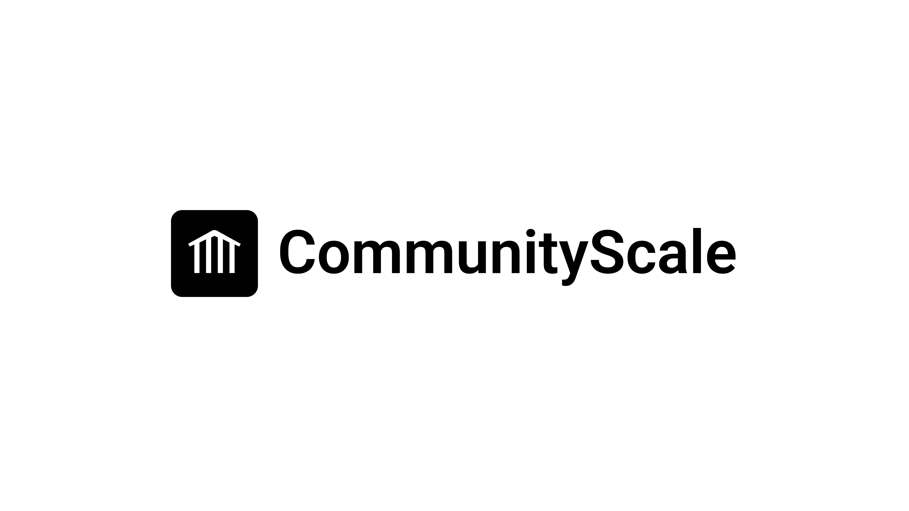

# Media Kit

Assets in PNG and SVG format for [CommunityScale](https://communityscale.com/). Some of the images are below for easy linking, more options are in the folders.

## Black Wordmark


**PNG:** `https://raw.githubusercontent.com/CommunityScale/media-kit/main/png/communityscale-wordmark-black.png`

**SVG:** `https://raw.githubusercontent.com/CommunityScale/media-kit/main/svg/communityscale-wordmark-black.svg`

## Rounded Logo - White on Black


**PNG:** `https://raw.githubusercontent.com/CommunityScale/media-kit/main/png/communityscale-logo-rounded-white-on-black.png`

**SVG:** `https://raw.githubusercontent.com/CommunityScale/media-kit/main/svg/communityscale-logo-rounded-white-on-black.svg`

## Square Logo - White on Black


**PNG:** `https://raw.githubusercontent.com/CommunityScale/media-kit/main/png/communityscale-logo-square-white-on-black.png`

**SVG:** `https://raw.githubusercontent.com/CommunityScale/media-kit/main/svg/communityscale-logo-square-white-on-black.svg`

## Social Card - White Background


**PNG:** `https://raw.githubusercontent.com/CommunityScale/media-kit/main/png/communityscale-social-card-white-bg.png`

## Social Card - Black Background


**PNG:** `https://raw.githubusercontent.com/CommunityScale/media-kit/main/png/communityscale-social-card-black-bg.png`

## Brand Colors

Brand colors are available as a JavaScript module with both light and dark theme variants, in hex and RGB formats.

**JS:** `https://raw.githubusercontent.com/CommunityScale/media-kit/main/colors/communityscale-brand-colors.js`

```js
import communityscaleColors from './colors/communityscale-brand-colors.js';

// Access colors by theme
communityscaleColors.light       // hex values for light theme
communityscaleColors.dark        // hex values for dark theme
communityscaleColors.lightRgb    // rgb values for light theme
communityscaleColors.darkRgb     // rgb values for dark theme
```

| Color | Light | Dark |
|-------|-------|------|
| Blue 1 (Primary) | `#192f5e` | `#adbfff` |
| Blue 2 | `#3445b0` | `#8795eb` |
| Blue 3 (Secondary) | `#6e79dd` | `#6e79dd` |
| Blue 4 | `#8795eb` | `#3445b0` |
| Blue 5 | `#adbfff` | `#192f5e` |
| Blue 6 (Background) | `#c2d8ff` | `#0d1a3a` |
| Yellow | `#ecd731` | `#f5e454` |
| Purple | `#9b5093` | `#c278b9` |
| Green | `#89aa42` | `#a8c96a` |
| Orange | `#ec8e46` | `#f5a76a` |
| Red | `#ec6448` | `#f58070` |

## Raw Asset Links

### Favicons
- [communityscale-favicon-192.png](https://raw.githubusercontent.com/CommunityScale/media-kit/main/favicon/communityscale-favicon-192.png)
- [communityscale-favicon-512.png](https://raw.githubusercontent.com/CommunityScale/media-kit/main/favicon/communityscale-favicon-512.png)

### SVG Images
- [communityscale-logo-rounded-black-on-white.svg](https://raw.githubusercontent.com/CommunityScale/media-kit/main/svg/communityscale-logo-rounded-black-on-white.svg)
- [communityscale-logo-rounded-white-in-black.svg](https://raw.githubusercontent.com/CommunityScale/media-kit/main/svg/communityscale-logo-rounded-white-in-black.svg)
- [communityscale-logo-rounded-white-on-black.svg](https://raw.githubusercontent.com/CommunityScale/media-kit/main/svg/communityscale-logo-rounded-white-on-black.svg)
- [communityscale-logo-square-black-on-white.svg](https://raw.githubusercontent.com/CommunityScale/media-kit/main/svg/communityscale-logo-square-black-on-white.svg)
- [communityscale-logo-square-white-on-black.svg](https://raw.githubusercontent.com/CommunityScale/media-kit/main/svg/communityscale-logo-square-white-on-black.svg)
- [communityscale-symbol-black.svg](https://raw.githubusercontent.com/CommunityScale/media-kit/main/svg/communityscale-symbol-black.svg)
- [communityscale-symbol-white.svg](https://raw.githubusercontent.com/CommunityScale/media-kit/main/svg/communityscale-symbol-white.svg)
- [communityscale-wordmark-black.svg](https://raw.githubusercontent.com/CommunityScale/media-kit/main/svg/communityscale-wordmark-black.svg)
- [communityscale-wordmark-white.svg](https://raw.githubusercontent.com/CommunityScale/media-kit/main/svg/communityscale-wordmark-white.svg)

### PNG Images
- [communityscale-logo-rounded-black-on-white.png](https://raw.githubusercontent.com/CommunityScale/media-kit/main/png/communityscale-logo-rounded-black-on-white.png)
- [communityscale-logo-rounded-white-on-black.png](https://raw.githubusercontent.com/CommunityScale/media-kit/main/png/communityscale-logo-rounded-white-on-black.png)
- [communityscale-logo-square-black-on-white.png](https://raw.githubusercontent.com/CommunityScale/media-kit/main/png/communityscale-logo-square-black-on-white.png)
- [communityscale-logo-square-white-on-black.png](https://raw.githubusercontent.com/CommunityScale/media-kit/main/png/communityscale-logo-square-white-on-black.png)
- [communityscale-social-card-black-bg.png](https://raw.githubusercontent.com/CommunityScale/media-kit/main/png/communityscale-social-card-black-bg.png)
- [communityscale-social-card-white-bg.png](https://raw.githubusercontent.com/CommunityScale/media-kit/main/png/communityscale-social-card-white-bg.png)
- [communityscale-symbol-black.png](https://raw.githubusercontent.com/CommunityScale/media-kit/main/png/communityscale-symbol-black.png)
- [communityscale-symbol-white.png](https://raw.githubusercontent.com/CommunityScale/media-kit/main/png/communityscale-symbol-white.png)
- [communityscale-wordmark-black.png](https://raw.githubusercontent.com/CommunityScale/media-kit/main/png/communityscale-wordmark-black.png)
- [communityscale-wordmark-white.png](https://raw.githubusercontent.com/CommunityScale/media-kit/main/png/communityscale-wordmark-white.png)


